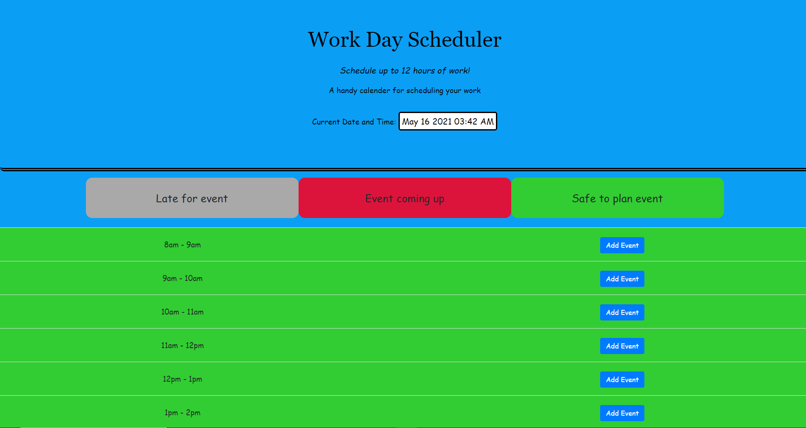

# 05 Third-Party APIs: Work Day Scheduler

## My Task
Create a simple calendar application that allows a user to save events for each hour of the day by modifying starter code. the table allso changes color according to how close your event is from coming up or too soon to schedule. You can not edit events that have already passed for that day. The deployed site can be seen here:https://cameronhouck.github.io/Work_day_Scheduler/

This app uses the following libraries: [Moment.js](https://momentjs.com/), [Bootstrap](https://getbootstrap.com/), [jQuery](https://api.jquery.com/),

## Preview
this is a view of the deployed site:

